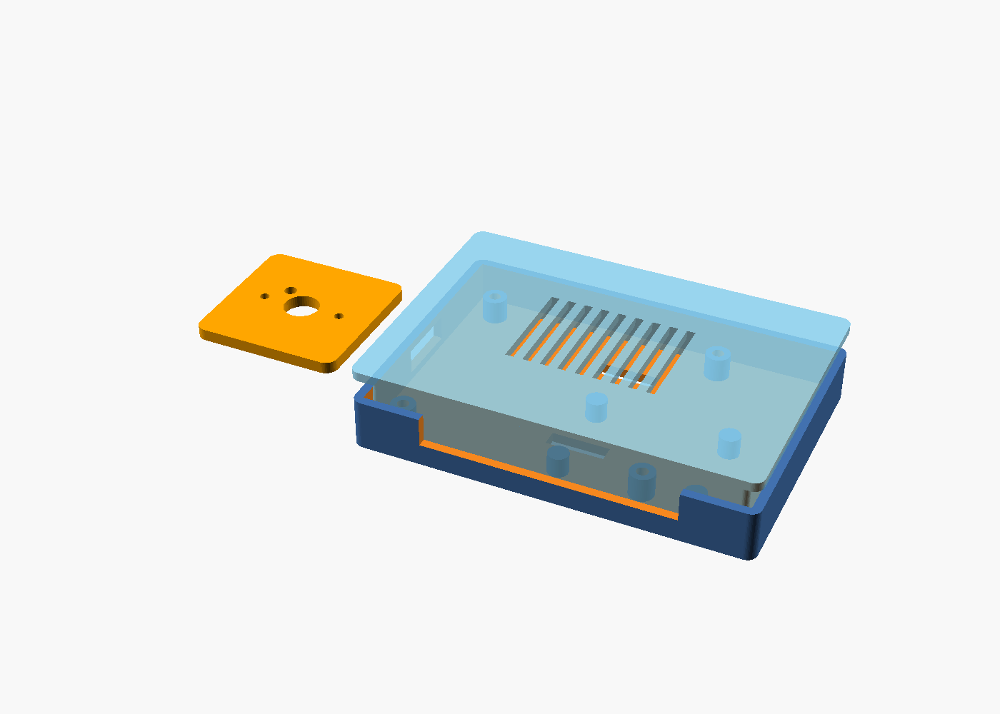

# AI-Powered Tailgating Detection and Driver Alert System

A low-cost, fully offline ADAS prototype. A rear-facing Raspberry Pi Camera
Module 3 feeds a Raspberry Pi 5 running YOLO26n + ByteTrack; when a vehicle
stays below a distance threshold in the ego lane for a sustained period, the
Pi pushes a Bluetooth Low Energy notification to the driver's phone.



## Architecture

```
Camera Module 3 ─CSI─> Raspberry Pi 5
                          │  Picamera2 capture (1280x720@30)
                          │  YOLO26n detection (imgsz=320, NMS-free)
                          │  ByteTrack persistent track IDs
                          │  Monocular distance (pinhole model + EMA smoothing)
                          │  Sliding-window decision (distance x time x lane)
                          └─BLE GATT notify──> Smartphone (nRF Connect / Flutter)
```

Everything runs on-device. No internet required or used.

## Repository layout

```
src/                   Python source (one module per pipeline stage)
  config.py            Every tunable, grouped by subsystem
  camera.py            Picamera2 backend + OpenCV fallback (video files!)
  detector.py          YOLO26n + ByteTrack wrapper
  distance_estimator.py  Pinhole-model distance + per-track smoothing
  tailgating_detector.py Decision logic (window, ratio, lane, cooldown)
  bluetooth.py         BLE GATT peripheral (bluezero/BlueZ)
  logger.py            Rotating logs + annotated event snapshots
  main.py              Entry point
tests/                 pytest unit tests for decision logic
hardware/
  cad/                 OpenSCAD source + printable STLs + preview
  diagrams/            Wiring and pinout
docs/                  BOM, calibration, testing, timeline, report skeleton
mobile/                Companion app design notes
```

## Install (on the Pi)

```bash
sudo apt update && sudo apt install -y python3-picamera2 bluez
git clone <your-repo-url> && cd tailgating-detector
python3 -m venv --system-site-packages .venv && source .venv/bin/activate
pip install ultralytics opencv-python numpy bluezero pytest
```

`--system-site-packages` lets the venv see the apt-installed picamera2.

## Run

```bash
cd src
python main.py                    # live camera
python main.py --video drive.mp4  # develop against recorded footage
python main.py --show             # with preview window (needs a display)
pytest ../tests -v                # decision-logic unit tests
```

First run downloads `yolo26n.pt` automatically. To receive alerts, open
nRF Connect on your phone, connect to **TailgateAlert**, and enable
notifications on the Alert characteristic.

## Key parameters (src/config.py)

| Parameter | Default | Meaning |
|---|---|---|
| `distance_threshold_m` | 8.0 | Closer than this = "too close" |
| `time_threshold_s` | 3.0 | Must persist this long |
| `violation_ratio` | 0.8 | Fraction of window frames below threshold |
| `lane_center_band` | 0.25 | Ego-lane filter (fraction of frame width) |
| `alert_cooldown_s` | 20.0 | Per-vehicle re-alert suppression |
| `imgsz` | 320 | Inference resolution (speed/accuracy trade) |

## Docs

- [Bill of Materials & cost](docs/BOM.md)
- [Wiring & assembly](hardware/diagrams/WIRING.md)
- [Camera calibration](docs/CALIBRATION.md)
- [Testing & validation plan](docs/TESTING.md)
- [Project timeline & risks](docs/TIMELINE.md)
- [Engineering report skeleton](docs/REPORT_OUTLINE.md)
- [Mobile app design](mobile/APP_DESIGN.md)

## Safety & legal notes

This is a driver-awareness prototype, not a certified safety device. It
must not be relied on for collision avoidance. Check local law before
mounting anything on a windshield/rear window, and mount the phone so
alerts don't create their own distraction (audio-only while driving).

## License

MIT (code). Note that Ultralytics YOLO weights are AGPL-3.0 — fine for a
personal/portfolio project; review licensing before any commercial use.
